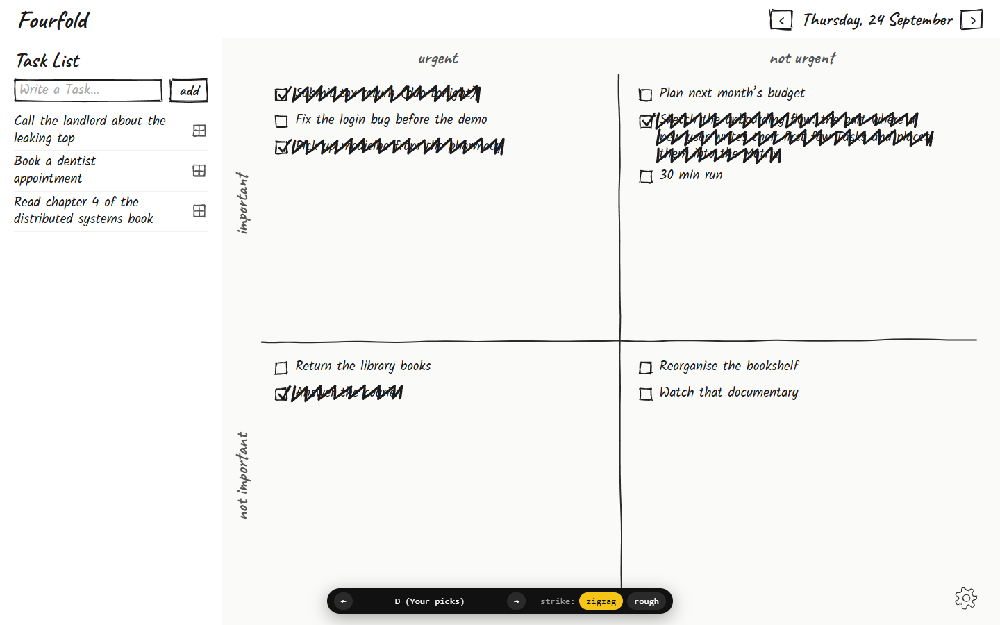
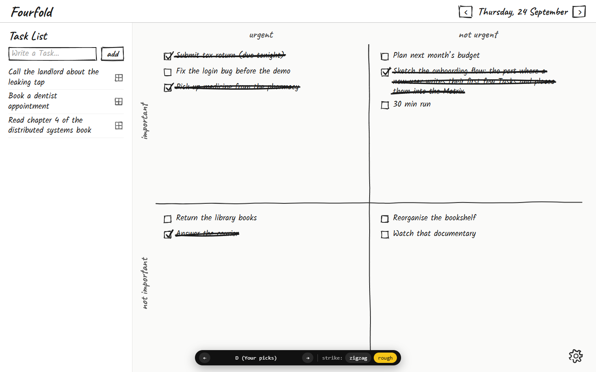
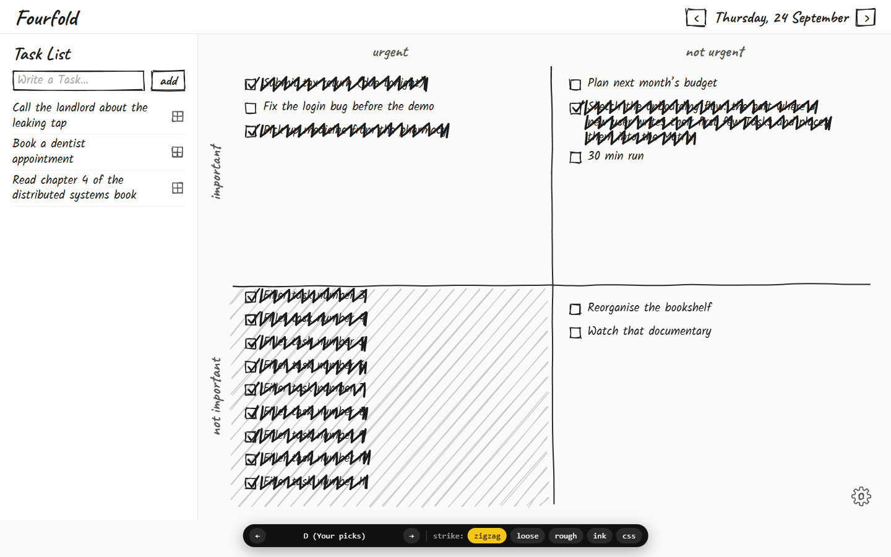
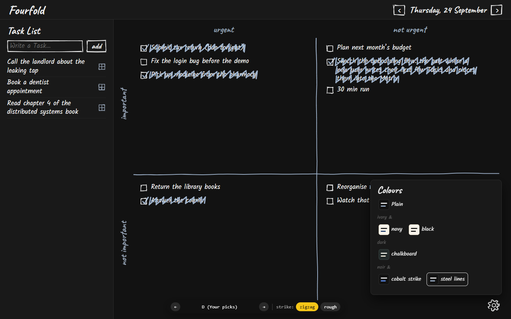
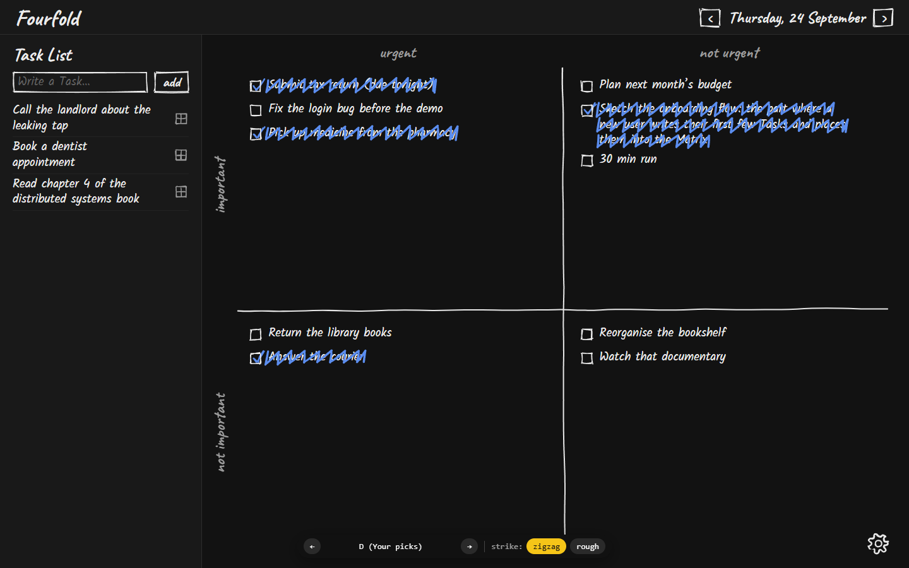

# Fourfold v1 spec

> **Temporary.** This spec is the hand-off for building Fourfold v1. The owner deletes it (along with the ADRs and `CONTEXT.md`) once v1 is built, tested and checked, so the code becomes the only record. Until then, any rule change edits this spec and `CONTEXT.md` / `docs/adr/` **in the same PR**; they must never disagree.
>
> It is self-contained: every rule a builder needs is stated here, as it stands now. The closed tickets on the [Fourfold v1 map](https://github.com/AnubhabMajumder/fourfold/issues/1) are background only; where an older ticket says something different (e.g. Local-only mode, PowerSync in v1, a "Current Matrix"), this spec wins. It also wins over the prototype code wherever they differ.

## Problem Statement

I write down far more things to do than I can do in a day, and the ordinary to-do list treats them all the same. I want to decide for myself, each day, what's important and what's urgent, and see that judgment laid out, without an app ranking or nagging me. At the end of a day I want to see what I got through, not have finished Tasks vanish. And I want this on my own laptop, private, free, and working without an internet connection.

## Solution

Fourfold is a personal Eisenhower-Matrix task manager that looks hand-drawn. I write Tasks into a single **Task List**, then place each one into a **Quadrant** of a **Matrix** for a date (Important/Urgent, and so on), in the position I choose. Completing a Task strikes it through with a scribble; it stays where it was, so the Matrix becomes a record of the day. Each date gets its own Matrix; tomorrow's can be started from 8pm, and each Matrix freezes into a read-only record at 6am the day after its date, kept forever.

v1 is a **web app on one laptop**: a small local API keeps the Tasks in a SQLite file on the laptop and serves the app on `127.0.0.1`. There's no account, no second device, and no internet needed.

## Glossary

Copied from `CONTEXT.md`; use these words, and avoid the listed alternatives, in code and UI.

- **Task**: a single thing the user intends to do, written in their own words. _Avoid_: todo, item, card.
- **Task List**: the single, ongoing list of Tasks the user has written but not yet placed. Every Task is written here first; it belongs to no date and waits across days until placed. Its order is the user's: a newly written Task goes to the top, and the user can move Tasks up or down. A Task in the Task List can be edited or deleted, but not completed. _Avoid_: inbox, backlog, today's list.
- **Matrix**: the four-Quadrant workspace where the user prioritizes the Tasks for one date. It exists only while it holds at least one placed Task: it comes into being with the first Placement and disappears if emptied before it freezes, so unused dates have none. Unfinished Tasks stay in their date's Matrix and are not carried forward. Tasks can be placed into today's Matrix, any earlier Matrix not yet frozen, and, from 8pm, tomorrow's. No Matrix is marked as the current one. _Avoid_: board, grid, session, current matrix, active matrix.
- **Frozen Matrix**: a Matrix whose editing window has ended (06:00 on the day after its date). No Task can be placed into it, deleted from it, returned to the Task List from it, or moved within or out of it; Task text can't be edited and Tasks can't be completed or un-completed. It stays viewable and looks exactly like an editable Matrix. _Avoid_: archived, closed, locked.
- **Quadrant**: one of the four regions of a Matrix: Important + Urgent, Important + Not Urgent, Not Important + Urgent, Not Important + Not Urgent. Each holds its placed Tasks as one ordered list whose order is the user's, never the app's. _Avoid_: box, column, bucket.
- **Placement**: the user's act of putting a Task from the Task List into a Quadrant, at a position they choose; such a Task is **placed**. Prioritization is always the user's judgment. A Task can't be written directly into a Quadrant, nor moved directly from one Matrix to another. Until its Matrix freezes, an unfinished placed Task can be returned to the Task List, leaving no trace. _Avoid_: categorize, sort, classify.
- **Completed Task**: a placed Task the user has marked done. It stays in its Quadrant, at the same position, struck through with a scribble. Until its Matrix freezes it can be edited, moved to another Quadrant or position, or un-completed, but not deleted or returned to the Task List directly.
- **Hub**, **Pairing**, **Pairing Code**, **Local-only**: terms for later multi-device efforts; none is part of v1.

## User Stories

### Writing and managing the Task List

1. As a user, I want to type a Task into an input at the top of the Task List and add it with an **add** button or Enter, so that capturing a thought is instant.
2. As a user, I want a newly written Task to appear at the top of the Task List, so that my latest thought is where I'm looking.
3. As a user, I want the Task List input focused when the app opens, so that I can start typing straight away.
4. As a user, I want the Task List to have no date, so that unplaced Tasks wait for me across days until I place them.
5. As a user, I want to drag Tasks up and down the Task List, so that it's in the order I care about.
6. As a user, I want to delete a Task from the Task List with a sketched × that appears when I hover it, so that I can drop things I no longer intend to do.
7. As a user, I want deletion to happen immediately with no confirmation and no undo, so that the interface stays minimal.
8. As a user, I want to double-click (or double-tap) a Task's text to edit it in place, so that I can fix wording without leaving the page.
9. As a user, I want Enter or clicking away to save an edit and Esc to cancel it, so that editing is predictable.
10. As a user, I want saving a Task List Task with empty text to delete it, so that clearing text is a quick way to remove a Task.
11. As a user, I want an empty Task List to show nothing at all (no "all placed" message), so that the page stays quiet.
12. As a user, I want Tasks in the Task List to have no checkbox, so that I can't complete a Task I haven't prioritized.

### Placing Tasks

13. As a user, I want to drag a Task from the Task List into a Quadrant at the exact position I drop it, so that its priority and its order within the Quadrant are both my call.
14. As a user without a drag gesture handy, I want a sketched mini-Matrix icon on each Task List Task that opens four Quadrant buttons, so that I can place a Task without dragging.
15. As a user, I want a Task placed with those buttons to go to the bottom of the Quadrant, so that the result is predictable, and I can drag it elsewhere afterwards.
16. As a user, I want placing a Task into a date with no Matrix to create that Matrix, so that a Matrix exists exactly when it holds something.
17. As a user, I want to place Tasks into whichever unfrozen Matrix I'm viewing, including yesterday's before 6am, so that I can finish recording yesterday after midnight.
18. As a user, I want to place Tasks into tomorrow's Matrix from 8pm, so that I can plan tomorrow the evening before.
19. As a user, I want Placement to be refused in a Frozen Matrix, so that past records stay as they were.

### Moving and reordering placed Tasks

20. As a user, I want to drag a placed Task to another position in its Quadrant, so that I can reorder my priorities during the day.
21. As a user, I want to drag a placed Task into another Quadrant at a chosen position, so that I can change my mind about its priority.
22. As a user, I want to move a Completed Task like any other placed Task, so that I can tidy the Matrix.
23. As a user, I want to send an unfinished placed Task back to the Task List with a sketched mini-list icon, so that I can un-prioritize it.
24. As a user, I want a Task sent back with that icon to go to the top of the Task List, and a dragged one to land where I drop it, so that it's where I expect.
25. As a user, I want a returned Task to leave no trace in its Matrix, so that the Matrix records only what I kept there.
26. As a user, I want returning the last Task from a Matrix to remove that Matrix, so that there are never empty Matrices.
27. As a user, I want moving a Task to another date to be "return, then place", with no shortcut, so that I re-judge its Quadrant for the new day.
28. As a user, I want Completed Tasks to not be returnable or deletable directly, so that my record of the day can't be erased by accident; to remove one I un-complete it first.
29. As a user, I want placed Tasks (in a Matrix) to not be deletable at all, so that deletion only happens in the Task List.
30. As a touch user, I want press-and-hold to start a drag while a quick swipe still scrolls, so that reordering doesn't hijack scrolling.

### Completing Tasks

31. As a user, I want to tick a placed Task's checkbox to complete it, so that I can mark it done.
32. As a user, I want a Completed Task struck through with a felt-pen zigzag drawn on over about a third of a second, so that finishing a Task feels satisfying.
33. As a user, I want a Completed Task to stay at the same position in its Quadrant with full-ink text, so that I can still read what I did.
34. As a user, I want to untick a Completed Task to un-complete it, with the scribble rubbed out, so that I can undo a mistaken tick.
35. As a user, I want a Quadrant whose Tasks are all Completed to be hatched across its whole frame, so that I can see at a glance what's cleared.
36. As a user, I want to choose a thick rough pencil line instead of the zigzag, so that the strike suits my taste.
37. As a user, I want to edit a placed or Completed Task's text before its Matrix freezes, and have empty text restore the old text, so that I can't delete a placed Task by clearing it.

### Getting around Matrices

38. As a user, I want the app to always open on today, so that I start where I'm working.
39. As a user, I want the header to show the date I'm viewing (e.g. "Thursday, 24 September") between ‹ and › buttons, so that I know which Matrix I'm on.
40. As a user, I want › to stop at today (and at tomorrow from 8pm), so that I can't wander into the future.
41. As a user, I want ‹ to skip straight to the previous date that has a Matrix, so that I don't page through empty days.
42. As a user, I want today to be reachable even when it has no Matrix, showing an empty Matrix frame, so that I can place into it.
43. As a user, I want looking at tomorrow to create nothing until I place a Task there, so that browsing has no side-effects.
44. As a user, I want pressing ‹ from my oldest Matrix to show "No earlier Matrix" in big bold handwriting, with ‹ faded and disabled, so that I know I've reached the start.
45. As a user, I want the Task List to stay in place whichever date I view, so that I can place into any Matrix I'm looking at.
46. As a user, I want the header to show only the date, with no "today"/"tomorrow"/"yesterday" word, so that it stays clean.

### Frozen Matrices

47. As a user, I want a Matrix to freeze at 06:00 on the day after its date, so that I have until the next morning to finish recording a day.
48. As a user, I want a Frozen Matrix to look exactly like an editable one, so that past days read as calmly as today.
49. As a user, I want a Frozen Matrix to refuse placing, moving, returning, deleting, editing, completing and un-completing, so that the record is permanent.
50. As a user, I want a Frozen Matrix to be kept forever, so that I can look back at any day.
51. As a user, I want a Matrix that freezes while I'm looking at it to stay on screen and simply start refusing changes (a drag in progress snaps back), so that nothing jumps.
52. As a screen-reader user, I want a Frozen Matrix's checkboxes announced as "checked, dimmed" (disabled), so that I know they can't be changed.

### Look and feel

53. As a user, I want the whole interface hand-drawn (handwriting font, sketched controls and icons, felt-pen dividers) on a clean plain page, so that it feels like my own notebook without clutter.
54. As a user, I want a header, the Task List on the left and the Matrix on the right, so that capture and prioritization sit side by side.
55. As a user, I want "urgent / not urgent" labelled across the top of the Matrix and "important / not important" down its left side, so that each Quadrant's meaning is clear.
56. As a user, I want to choose one of six colour schemes from a doodled gear in the Matrix's bottom-right corner, so that the app suits my eyes and mood.
57. As a user, I want my colour scheme and strike style remembered on this laptop, so that I set them once.
58. As a user, I want no empty-Quadrant hints, no counts and no undo notes, so that the page stays minimal.
59. As a user, I want each sketched line to look the same every time I open the app, so that the drawing feels stable, not jittery.

### Accessibility

60. As a screen-reader user, I want each placed Task to be a real checkbox labelled by its text, so that I hear "Buy milk, checkbox, checked".
61. As a user with reduced motion enabled, I want the scribble to appear already drawn, so that nothing animates at me.
62. As any user, I want the scribble to animate only when I complete a Task, never on load, so that opening the app is calm.
63. As a low-vision user, I want the strike to have at least 3:1 contrast against the Quadrant background in every scheme, so that I can see what's done.
64. As a keyboard user, I want the mini-Matrix and mini-list buttons and the checkboxes to be reachable and operable with the keyboard, so that I can place, return and complete without a mouse.

### Running Fourfold

65. As a user, I want a `Start Fourfold` shortcut that starts the local API if it isn't running and then opens the app (installed app if present, otherwise a browser tab), so that opening Fourfold is one action.
66. As a user, I want to install Fourfold as an app from the browser, so that it has its own window and icon.
67. As a user, I want Fourfold to need no internet connection, so that it works anywhere on my laptop.
68. As a user, I want my Tasks kept in one file on my laptop, outside the code, so that updating the app doesn't touch my data.
69. As a user, I want Fourfold to always use the same port and to exit with a clear message if that port is taken, so that my installed app and saved colour scheme keep working.
70. As a user, I want a sketched "Fourfold isn't running" card to cover the dimmed page if the API goes away while the app is open, so that I don't make changes that can't be saved.
71. As a user, I want that card to disappear by itself within a few seconds of the API coming back, with everything re-fetched, so that I don't have to reload.
72. As a user, I want switching back to the Fourfold window to refresh what it shows, so that two windows don't drift apart.
73. As a user, I want the first launch to show the normal, empty screen with no welcome or onboarding, so that I can just start.
74. As a user, I want changes to appear on screen instantly and quietly snap back if they're refused, so that the app feels immediate without error pop-ups.

### Builder / maintainer

75. As a builder, I want the Matrix rules written once in a shared, DOM-free `core` package, so that the API and web app (and a later mobile app) agree on what's allowed.
76. As a builder, I want the API to have the final say on every change, so that the web app can't corrupt the data.
77. As a builder, I want to run the API against a temporary database and a clock I control, so that the 8pm and 6am rules can be tested.
78. As a future maintainer, I want the database to avoid SQLite-only features and use UUIDs and UTC timestamps, so that moving to an online database later is cheap.

## Implementation Decisions

### Architecture

- **Monorepo:** pnpm workspace, Node + TypeScript throughout. Three parts:
  - **Web app:** React + TypeScript, built with Vite as a static single-page app.
  - **Local API:** Hono + Drizzle + better-sqlite3. Drizzle-kit migrations are applied when the API starts.
  - **`core` package:** the domain model, the Matrix rules, the API client and shared types, including the fixed port. **No DOM imports**, so a future React Native app can use it. The UI is per-platform; only the view layer would be written twice.
- **One process:** the API serves both the built web app and `/api` on `http://localhost:<fixed port>`, listening on `127.0.0.1` only. No separate static host, no PowerSync in v1, no copy of the data in the browser.
- **Why not PowerSync + Postgres (the later Hub stack) in v1:** with one device there is nothing to sync, and it would mean three always-on processes (Postgres, the PowerSync service, a token/upload API), with Postgres in Docker Desktop costing 1–2 GB of RAM on Windows Home. Accepted trade-off: the app does nothing unless the API is running, and adding multi-device sync later changes the data path, not just a deployment.
- **Database file:** a single SQLite file at `%LOCALAPPDATA%\Fourfold\fourfold.db`, outside the repo. No backups in v1: losing the file loses every Task.
- **Portability rules** (for a later online database): go through Drizzle, UUID ids, UTC ISO timestamps, no SQLite-only features.
- **Configurable for tests:** the API process accepts, at start-up, the database location and a clock source (real clock by default). Production always uses the default file and the real clock.
- **PWA:** installable via a web app manifest only, **no service worker**. It works in a normal tab too.
- **Starting:** by hand. `Start Fourfold` (a desktop shortcut) starts the API if it's not running, then opens the installed app if there is one, otherwise a browser tab; if the API is already running it just opens the app. `pnpm start` only starts the API (development). No auto-start.
- **Fixed port**, defined in `core`. If it's taken, the API prints a clear console message and exits; it never falls back to another port (the installed app and the saved colour scheme are tied to the exact origin).

### Matrix rules and the clock (in `core`)

- **Written once in `core`.** The API uses them to refuse changes and has the final say; the web app uses the same code to decide what's allowed on screen (e.g. whether a drop target accepts, whether › is enabled).
- **Clock:** the laptop's local time and time zone at the moment of each check. A Matrix's date is a plain calendar date (`YYYY-MM-DD`).
- **Frozen:** a Matrix is frozen once local time is at or past 06:00 on the day after its date. **Always calculated, never stored**; no scheduled job (the API is often off at 6am). The builder must put a short code comment at the freeze calculation explaining this.
- **Placeable dates:** a date's Matrix accepts Placement if it isn't frozen and the date is not after today, except that from 20:00 local time tomorrow is also placeable. Nothing beyond tomorrow ever is.
- **What each state allows** while its Matrix is not frozen:

  | Task state | Edit text | Move (position / Quadrant) | Complete | Un-complete | Return to Task List | Delete |
  |---|---|---|---|---|---|---|
  | In the Task List | yes | yes (within the Task List) | no | no | n/a | yes |
  | Placed, unfinished | yes | yes (same Matrix only) | yes | no | yes | no |
  | Completed | yes | yes (same Matrix only) | no | yes | no | no |

  In a Frozen Matrix every column is "no". Placement (Task List → Quadrant) needs a placeable date. There is no direct move between Matrices.
- **Matrix existence:** the first Placement on a date creates its Matrix in the same transaction. Returning the last Task deletes the Matrix in the same transaction. No other path creates or removes a Matrix; there is never an empty Matrix.

### Data model (SQLite via Drizzle)

- **`matrices`**: one column, `date` (plain calendar date), the primary key. A deliberate exception to the UUID rule: one Matrix per date, so a later multi-device setup can't create duplicates. No `created_at`.
- **`tasks`**:
  - `id`: UUID, **created by the web app** (so optimistic updates know the id).
  - `text`: non-empty.
  - `created_at`: UTC ISO timestamp.
  - `matrix_date`: empty while the Task is in the Task List; otherwise a foreign key to an existing Matrix.
  - `quadrant`: empty in the Task List; otherwise one of the four Quadrants.
  - `position`: sortable text key (fractional indexing), so a move rewrites one row. Used for both Quadrant order and Task List order.
  - `completed_at`: UTC ISO timestamp, empty unless Completed.
- The database refuses to delete a Matrix while any Task belongs to it.
- **Returning** a Task empties `matrix_date`, `quadrant` and `completed_at` (it's unfinished anyway) and gives it a Task List position. **Deleting** removes the row; no soft delete.
- **Task List order:** user-set, newest first. New Tasks and Tasks returned via the mini-list button get a position above the current top; dragged Tasks get the position where they're dropped.

### API contract

All under `/api`, JSON bodies, one endpoint per action:

| Endpoint | What it does |
|---|---|
| `GET /api/task-list` | The Task List, in order |
| `GET /api/matrices` | The dates that have a Matrix (used by ‹ ›) |
| `GET /api/matrices/:date` | One Matrix and its Tasks, grouped by Quadrant, in order |
| `POST /api/tasks` | Writes a new Task at the top of the Task List; body carries the web-created `id` and `text` |
| `PATCH /api/tasks/:id` | Changes the text |
| `DELETE /api/tasks/:id` | Deletes a Task (Task List only) |
| `POST /api/tasks/:id/place` | Date, Quadrant and optional position; without a position the Task goes to the bottom of the Quadrant |
| `POST /api/tasks/:id/move` | Reorders within a Matrix (including into another Quadrant of the same Matrix) or within the Task List |
| `POST /api/tasks/:id/return` | Optional position; without one the Task goes to the top of the Task List |
| `POST /api/tasks/:id/complete` | Completes a placed Task |
| `POST /api/tasks/:id/uncomplete` | Un-completes a Completed Task |

- Matrices are never created or deleted through the API directly.
- **Refusals:** a change the rules forbid gets **`409`** with a machine-readable reason code, e.g. `matrix_frozen`, `date_not_placeable`, `completed_task_not_deletable`, `task_not_placed`, `task_already_placed`, `empty_text`. The exact code list is the builder's to finalise; each rule in the table above must map to one.
- **Web behaviour:** the web app updates the screen first and sends the change in the background. On a `409` it snaps the change back and re-fetches, silently (no message). On a network failure it snaps the change back and shows the "isn't running" card (below).

### Screens and interactions

- **Layout** (see screenshots): a header with "Fourfold" on the left and ‹ date › on the right; below it, the Task List as a fixed-width left column (about 320px) and the Matrix filling the rest.
- **Task List column:** heading "Task List"; a sketched input with placeholder *"Write a Task…"* and a separate sketched **add** button; then the Tasks, one per row with a faint rule between rows. Each row shows the text, a sketched mini-Matrix icon (opens four small Quadrant buttons, each a mini-Matrix with one Quadrant marked), and on hover a sketched ×.
- **Matrix:** axis headers "urgent" / "not urgent" across the top and "important" / "not important" down the left; felt-pen dividers form the four Quadrants: top-left Important + Urgent, top-right Important + Not Urgent, bottom-left Not Important + Urgent, bottom-right Not Important + Not Urgent. Each Quadrant is a vertical list that scrolls on its own if it overflows. Each placed Task: a sketched checkbox, the text, and on hover a sketched mini-list icon (return; not shown on Completed Tasks). Tasks are drawn straight (no tilt or scatter).
- **Drag and drop:** from the Task List into a Quadrant at a position; within and between Quadrants of the same Matrix; from a Matrix back to the Task List at a position; within the Task List. A drop line (a 3px ink line) shows where the Task will land; the dragged Task follows the pointer as a slightly rotated floating card with a soft shadow. A drop that the rules would refuse isn't offered (the target doesn't accept); anything refused anyway snaps back.
- **Touch:** press-and-hold starts a drag; a quick swipe scrolls. No ↑/↓ arrows, no tap-to-move.
- **Editing:** double-click (double-tap on touch) the text turns it into an in-place input; Enter or blur saves, Esc cancels. Empty text: deletes a Task List Task; restores the previous text for a placed or Completed Task. In a Frozen Matrix, double-click does nothing.
- **"No earlier Matrix":** pressing ‹ from the oldest Matrix (or from today when no Matrix exists) shows the Matrix area empty with *"No earlier Matrix"* in big bold handwriting; ‹ is faded and disabled; › returns. The Task List stays.
- **Settings gear:** a doodled gear in the Matrix's bottom-right corner opens a small sketched pop-over with the six colour schemes as swatches and the strike style (zigzag / rough line). Both are saved in the browser's local storage for this origin; defaults are **plain** and **zigzag**.
- **"Fourfold isn't running" card:** shown when a change fails to reach the API or a re-fetch on window focus fails (no background polling otherwise). A sketched card over the dimmed page, not dismissable; the page behind takes no changes. Wording: **Fourfold isn't running** / Start it with the Start Fourfold shortcut. / *This page will catch up by itself.* While shown, the app checks the API every 3 s; when it answers, the app re-fetches everything and removes the card with no message. `409`s never show it.
- **Re-fetch on focus:** each window re-fetches the Task List, the Matrix dates and the viewed Matrix when it regains focus.
- **First launch:** header with today's date; empty Task List with the input focused; today's Matrix frame drawn empty with dividers and axis headers. No welcome, onboarding or hint.
- **Opening while the API is off:** the browser shows its own "can't connect" page; accepted, no service worker to work around it.

### Look and feel

(The black bar at the bottom of the screenshots is the prototype's variant switcher, not part of the design.)

- **Direction:** hand-drawn across the whole UI on a clean, minimalist page. No paper texture, grain or ruled-page background. Everything you touch or read is drawn: handwriting text, sketched checkboxes, buttons and icons, felt-pen dividers, the scribbled strike.
- **Fonts** (both OFL-1.1, **bundled with the app**, not loaded from Google Fonts, since there's no internet requirement): **Kalam** 400/700 for Task text and body (19px, line-height 1.3); **Caveat** 700 for the app name (36px), the date (26px), the "Task List" heading (30px), axis headers (26px) and the add button (22px). Load fonts before measuring text, since a late swap re-wraps Task text under already-drawn strikes.
- **Rendering rules:**
  - Sketched lines are **seeded vectors** (rough.js generator for boxes, checkboxes, icons, strikes' rough variant and hatching; perfect-freehand for felt-pen ink lines), rendered as SVG paths in `aria-hidden` layers. A shape's seed derives from a stable id (the Task's UUID for per-Task shapes, fixed numbers for chrome), so it looks the same on every render.
  - **Task text stays real DOM text** in the handwriting font. No SVG turbulence/displacement filters on text, ever. The builder must put a short code comment explaining this where the strike is drawn: filters warp glyphs, hurt readability and don't exist in react-native-svg.
  - Dividers are regenerated only on resize.
- **Strokes** (rough.js options, from the prototype):
  - Matrix dividers: felt-pen (perfect-freehand) ink lines, roughly 2.2px.
  - Sketched boxes (inputs, buttons, checkboxes): roughness 1.2, bowing 1, stroke 1.5.
  - Checkbox tick: a polyline, roughness 1.2, stroke 2.4, in the scheme's strike colour.
  - Icons (mini-Matrix, mini-list, gear): roughness 0.8, bowing 0.5, stroke 1.3–1.4. Delete ×: roughness 0.9, bowing 0.6, stroke 1.6, single stroke.
  - **Zigzag strike (default):** a felt-pen `|/|/|/|` zigzag across each line of the Task's text that starts and ends on a down stroke, drawn on with a stroke-dash animation of about 0.35s ease-out.
  - **Rough-line strike (option):** a thick rough.js pencil line through each text line, roughness 1.6, bowing 2, stroke 3.4, wiped on over about 0.4s.
  - Strike and tick share the scheme's strike colour; Completed text keeps full ink.
  - **All-Completed Quadrant:** hachure fill across the whole Quadrant frame (even when its list scrolls), angle −41°, gap 16, weight 1.4, roughness 1.4, in the strike colour.
- **Colour schemes** (CSS custom properties; "plain" is the default):

  | Scheme | bg | panel | ink | muted | faint | line / line-soft | divider | strike | danger |
  |---|---|---|---|---|---|---|---|---|---|
  | plain | `#fafaf9` | `#fff` | `#1c1c1c` | `#555` | `#aaa` | `#e5e5e5` / `#f0f0f0` | `#2b2b2b` | `#1c1c1c` | `#b0321f` |
  | ivory & navy | `#f7f3ea` | `#fffdf8` | `#161616` | `#4a5d80` | `#b9ad93` | `#e6dcc6` / `#efe8d8` | `#161616` | `#1f3a68` | `#8e2a1c` |
  | ivory & black | `#f7f3ea` | `#fffdf8` | `#161616` | `#5f594d` | `#b9ad93` | `#e6dcc6` / `#efe8d8` | `#161616` | `#161616` | `#8e2a1c` |
  | chalkboard | `#232b2a` | `#283230` | `#eceee6` | `#a8b4ad` | `#6f7c77` | `#3a4644` / `#313c3a` | `#e3e6dc` | `#f4f1e2` | `#f0a08a` |
  | noir & cobalt strike | `#121212` | `#191919` | `#ececec` | `#9c9c9c` | `#636363` | `#2d2d2d` / `#232323` | `#e6e6e6` | `#5b8def` | `#e8836e` |
  | noir & steel lines | `#121212` | `#191919` | `#ececec` | `#95a3b5` | `#636363` | `#2d2d2d` / `#232323` | `#9fb3cc` | `#9fb3cc` | `#e8836e` |

  Extra tokens: `soft` (hover / drop-target fill) is `#f0f0ee` plain, `#f0e8d6` ivory, `#33403e` chalkboard, `#262626` noir; `rule` (header underline) is `#c4c4c4` plain, `#cdbf9f` ivory, `line` for dark schemes; `shadow` is `rgba(0,0,0,.15)` light, `rgba(0,0,0,.6)` dark. Axis headers use `muted`; the delete × turns `danger` on hover.
- **Minimalism:** no empty-Quadrant hints, no done counts, no undo notes, no "all placed" text, no Current Matrix marker, no today/tomorrow words.
- **Frozen Matrix** looks identical to an editable one; controls that would change it simply don't respond.

### Accessibility

- A placed Task's completed state is the `checked` state of a native checkbox whose label is the Task text. The scribble SVG is `aria-hidden`. Don't rely on `<s>`/`<del>` for meaning, don't put `aria-checked` on list items, don't `aria-label` generic elements.
- In a Frozen Matrix the checkbox is **disabled but styled to look enabled**; screen readers announce "checked, dimmed".
- The strike needs **3:1 contrast** against the Quadrant background in every scheme (verify all six).
- **Reduced motion:** under `prefers-reduced-motion: reduce` the scribble appears already drawn and un-completing removes it at once. Gate CSS with the media query and JS with `matchMedia` plus a `change` listener. The scribble animates only on the completing action, never on load; no idle animation anywhere.
- Checkboxes, the mini-Matrix / Quadrant buttons, the mini-list button, ‹ ›, add and the gear are native buttons/inputs reachable by keyboard, with a visible focus outline (2px, strike colour). Keyboard-driven dragging (reordering by keyboard) is out of scope.

### Size target

Stays smooth (drag, typing, strike animation) with **200 Tasks in the Task List and 50 in one Matrix**. No formal performance test.

### Future-proofing

- `core` has no DOM imports and holds everything a React Native client would share: rules, types, API client.
- Sketch geometry is plain path data (portable to react-native-svg or Skia).
- Database portability rules as above, so an online database or a Hub can come later.

## Testing Decisions

- **What a good test is:** it exercises external behaviour through a public seam (HTTP requests and responses, or what a user sees and does in the browser) and never reaches into internals. Tests describe rules in domain words ("a Completed Task can't be deleted"), and survive refactors of how the rules are implemented.
- **Seam 1: the local API over HTTP (primary).** Tests call the Hono app in-process with a fresh in-memory SQLite database and a controllable clock. This seam covers the `core` rules too (the API has the final say), so `core` is not unit-tested separately. Must cover:
  - 8pm: tomorrow is refused at 19:59 and accepted at 20:00; the day after tomorrow is always refused.
  - 6am freeze: a Matrix accepts changes at 05:59 the next day and refuses every kind of change (place, move, return, edit, complete, un-complete) at 06:00, with `409 matrix_frozen`.
  - Every cell of the state table, including `409`s for deleting a placed or Completed Task, returning a Completed Task, completing a Task List Task, and moving a Task between Matrices.
  - The first Placement creates the Matrix; returning the last Task removes it; **no sequence of calls ever leaves an empty Matrix** (checked after each call in the tests).
  - Positions: place without a position goes to the bottom; return without a position goes to the top; new Tasks go to the top; moves rewrite only the moved Task and produce the requested order; completing doesn't change position.
  - Returning clears all Matrix fields; deleting removes the row; empty text is refused.
  - Migrations apply cleanly to an empty database on start-up.
- **Seam 2: the web app end to end (Playwright).** Runs against the real served app with a temporary database file and the same controllable clock, covering only what the API seam can't: drag and drop into positions, the mini-Matrix / mini-list buttons, optimistic update then snap-back on a `409`, the "isn't running" card appearing on a failed change and disappearing after the API returns (3 s retry), re-fetch on focus, double-click editing (Enter / Esc / blur / empty text), checkbox complete and un-complete, reduced-motion scribble, ‹ › limits and "No earlier Matrix", the first-launch screen, and the colour scheme persisting across reloads.
- **Prior art:** none in this repo yet; these seams are new. The prototype has no tests.

## Out of Scope

- Mobile client (a separate later effort; `core` keeps it open).
- Multi-device sync, the Hub, Pairing, conflict rules, remote access (Tailscale, HTTPS).
- An online database; cloud-hosted sync backends.
- Local-only (browser-only) mode; a service worker; offline caching of the app.
- Backups of the SQLite file.
- Shared or multi-user use; accounts.
- Due dates, reminders/notifications, tags, subtasks, sharing; named side-by-side Matrices.
- Copying unfinished Tasks from a past Matrix into the Task List.
- Deleting a Frozen Matrix.
- Time-zone changes (v1 uses the laptop's current time zone).
- A calendar or history view; any navigation other than ‹ ›.
- Keyboard-driven dragging.
- Undo.
- Auto-starting the API with Windows.
- Splitting this spec into build issues (the first step of the build effort, not part of this spec).

## Further Notes

- **Prototype code:** the throwaway prototypes are on the [`prototype/visual-direction`](https://github.com/AnubhabMajumder/fourfold/tree/prototype/visual-direction/prototypes/visual-direction) and [`prototype/api-unreachable`](https://github.com/AnubhabMajumder/fourfold/tree/prototype/api-unreachable/prototypes/visual-direction) branches (won't be merged). The builder may copy its drawing helpers (the seeded rough.js / perfect-freehand geometry, zigzag, sketched boxes and icons) as a starting point, but rebuilds the app structure and state. The prototype predates some decisions (navigation, editing, un-completing), so **where the prototype and this spec differ, the spec wins.**
- **Two reasons to keep as code comments** (because this spec, the ADRs and `CONTEXT.md` will be deleted): why freezing is calculated from the local clock and never stored; why Task text stays real text with the hand-drawn look only on vector lines.
- **Synthesised, not explicitly decided on a ticket** (check during build): the strike-style choice living in the settings gear next to the colour schemes (the prototype switched it with a URL parameter); both settings stored in browser local storage; fonts bundled rather than loaded from Google Fonts; the exact `409` reason-code list; the header date format ("Thursday, 24 September", as in the prototype).
- **Decision history:** the [Fourfold v1 map](https://github.com/AnubhabMajumder/fourfold/issues/1) and its closed tickets.
